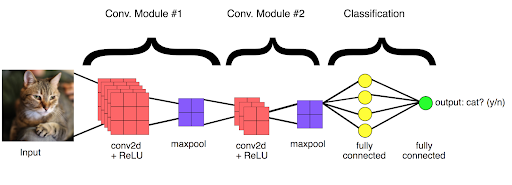
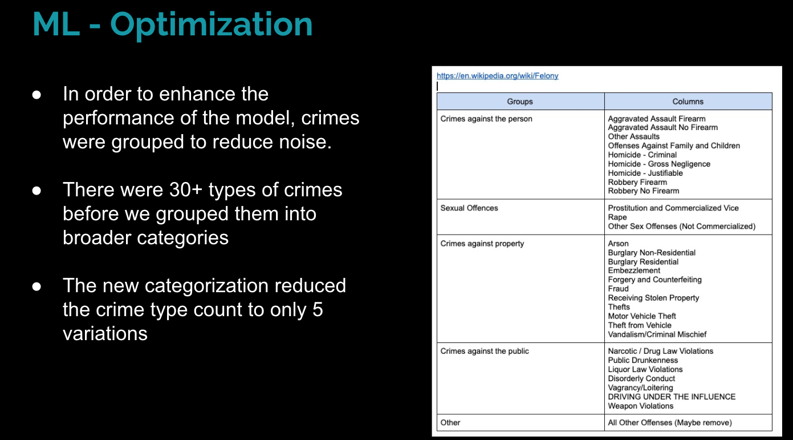
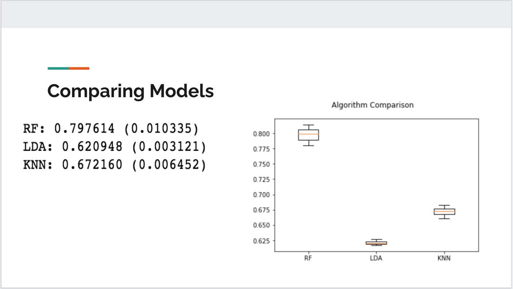

# Portfolio
Hong Son's Data Science Portfolio

# [Project (2021): Tensorflow Gemstone Classification](https://github.com/hongson6/Tensorflow-Gemstone-Classification)
* Load, resized, and cleansed the gemstone data 
* Researched Convolutional Neural Networks (CNN) and the possible uses for gemstone image classification
* Utilized VGG16 Model (pre-trained CNN Model) for image classification
* Utilized CNN Model (own CNN Model) for image classification
* Determined our own train CNN Model to be the best applicable model, achieving classification accuracy score of 0.49 with only 18 epochs. 

### [For More Details](https://github.com/hongson6/Tensorflow-Gemstone-Classification#readme)

_CNN process:_

# [Project (2020-2021): Crime in Philadelphia](https://github.com/hongson6/Crime-in-Philadelphia)
* Prepared the data for EDA by cleansing and merging the data with weather and parking violations data
* Answered questions focused on location using zip-code and lat/lon data
* Ultized KNN, Decision Tree, Extra Trees, Random Forest, Logistic Regression (supervised) models to predict the Crimes based on Text General Code (Type of Crime)
* Reduced crime categories to optimize the models
* Determined Decision Tree to be the best applicable model, achieving classification accuracy score of 0.53 

### [For More Details](https://github.com/hongson6/Crime-in-Philadelphia#readme)

_New Groupings:_

# [Project (2019): Predicting Accident Severity](https://github.com/hongson6/Predicting-Accident-Severity)
* Prepared the data for EDA by cleansing and merging the data with casualties and parking vechicle data
* Conducted times series, serverity, and road condition analysis
* Utilized Stratified 10 fold cross validation for class imbalances in training and testing data 
* Utilized PCA and RandomForestClassifier for feature selection
* Ultized KNN, Linear Discriminant Analysis, Random Forest models (supervised) to to predict accident severity
* Determined Random Forest to be the best applicable model, achieving classification accuracy score of 0.80 through 10 folds cross validation

### [For More Details](https://docs.google.com/presentation/d/1JEkXNDNjnCQC1EW4ws0GsdIt-N84VtjD9HVhGMuGWlw/edit?usp=sharing)

_snippet from Presentation:_

